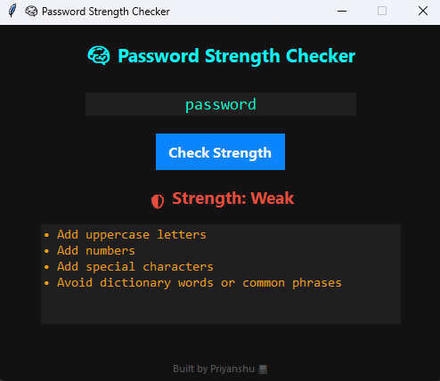
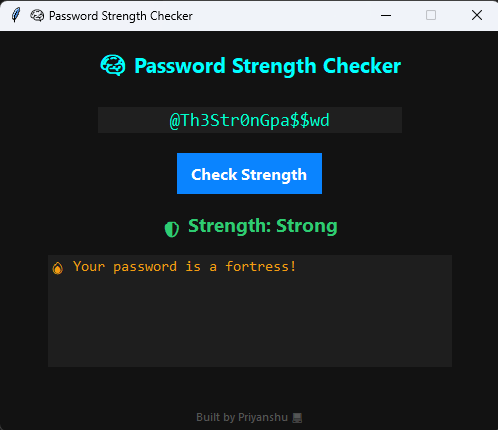

# Password Strength Checker

> ⚠️ **FOR EDUCATIONAL PURPOSES ONLY**  
This GUI-based tool is designed to demonstrate **password evaluation techniques** — including dictionary word detection, pattern analysis, and security scoring.  
**DO NOT use this as a replacement for real password hashing or storage systems.**  
This is for **learning and demonstration** only.

---

## 🎯 Objective

Simulate a realistic password-checking mechanism that:

- Analyzes password structure and complexity
- Detects dictionary words, repeated characters, and weak patterns
- Gives real-time feedback and actionable suggestions
- Encourages the use of secure, hard-to-crack passwords

---

## 🧪 Features

| Feature                                 | Status |
|-----------------------------------------|--------|
| GUI interface with modern dark theme    | ✅     |
| Length and complexity checks            | ✅     |
| Regex-based pattern matching            | ✅     |
| Repeating character detection           | ✅     |
| NLTK dictionary word scan (optional)    | ✅     |
| Password strength rating (Weak/Med/Strong) | ✅     |
| Live improvement suggestions            | ✅     |
| .exe bundling support                   | ✅     |

---

## 🧰 Requirements

- Python 3.x  
- [nltk](https://pypi.org/project/nltk/)  
- `tkinter` (comes with Python)  
- `re` (built-in)

### Install dependencies

```bash
pip install -r requirements.txt
```

Or manually:

```bash
pip install nltk
```

> 💡 The app downloads the NLTK word corpus on first run (if available).

---

## 📁 Folder Structure

```
📁 password-strength-checker/
│
├── checker_gui.py       # Main GUI script
├── README.md                     # This file
├── requirements.txt              # Dependencies
└── assets/                       # Screenshots
    ├── pic1.png
    └── pic2.png
```

---

## ⚙️ How It Works

1. Password is fetched from input field
2. Strength is scored based on:
   - Length
   - Uppercase / lowercase / digits / special chars
   - Pattern repetition (like `aaa`)
   - Word check (if found in NLTK dictionary)
3. GUI updates label with:
   - 🟥 Weak (0–3 points)
   - 🟨 Medium (4–5 points)
   - 🟩 Strong (6+ points)
4. Suggestions are printed to help user improve their password

---

## 🚀 Usage

### Run with Python

```bash
python strength_checker.py
```

### Build a `.exe` (Windows only)

```bash
pip install pyinstaller
pyinstaller --onefile --windowed strength_checker.py
```

> 🧨 Final `.exe` will be created in `dist/` folder.

---

## 🧼 Reset (if modifying the corpus)

```bash
python
>>> import nltk
>>> nltk.download('words')
```

Or delete the NLTK cache if needed.

---

## 🛡️ Disclaimer

This tool is for **educational use only**. It does **NOT store, transmit, or hash passwords**.  


---

## 🧠 Author Note

Crafted with precision by **Priyanshu** —  


---

## 📷 Screenshots

### 🧠 Strength rated: Weak 



### 🟢 Strength Rated: Strong


